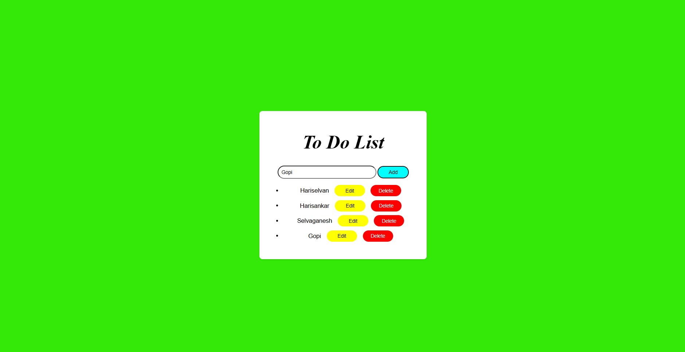

# Ex03 To-Do List using JavaScript
## Date:15-09-2025

## AIM
To create a To-do Application with all features using JavaScript.

## ALGORITHM
### STEP 1
Build the HTML structure (index.html).

### STEP 2
Style the App (style.css).

### STEP 3
Plan the features the To-Do App should have.

### STEP 4
Create a To-do application using Javascript.

### STEP 5
Add functionalities.

### STEP 6
Test the App.

### STEP 7
Open the HTML file in a browser to check layout and functionality.

### STEP 8
Fix styling issues and refine content placement.

### STEP 9
Deploy the website.

### STEP 10
Upload to GitHub Pages for free hosting.

## PROGRAM
```
<!DOCTYPE html>
<html lang="en">
<head>
    <meta charset="UTF-8">
    <meta name="viewport" content="width=device-width, initial-scale=1.0">
    <title>TO-Do-List</title>
   <style>
    body{
        font-family: Arial, sans-serif;
        background-color: rgb(52, 233, 7);
        margin: 0;
        padding: 20px;
        margin-top:15%;
    }
    .card-container {
        background: white;
        padding: 20px;
        border-radius: 8px;
        box-shadow: 0 2px 4px rgba(0,0,0,0.1);
        max-width: 400px;
        margin: auto;
        height:50%;
        text-align:center;
    }
    h1{
        font-size:50px;
        font-family:"Caveat";
        font-style:italic;
    }
    #taskInput{
        width:60%;
        padding:8px;
        border-radius: 20px;
    }
    .add{
        width:80px;
        height:30px;
        border:none;
        background-color:aqua;
        border-radius: 15px;
    }
     .delete{
        width:80px;
        height:30px;
        margin-left:15px;
        border: none;
        border-radius:15px;
        background-color: red;
        color:white;
        margin-bottom:10px;
    }
     .edit{
        width:80px;
        height:30px;
        margin-left: 15px;
        border:none;
        border-radius:15px;
        background-color:yellow;
        margin-bottom:10px;
    }
   </style>
</head>
<body>
    <div class="card-container">
        <h1>To Do List</h1>
        <input type="text" id="taskInput" placeholder="Enter a new task">
        <button onclick="addTask()" class="add">Add</button>
        <ul id="taskList"></ul>
    </div>

    <script>
        const taskInput = document.getElementById('taskInput');
        const taskList = document.getElementById('taskList');
        function addTask() {
            var list=document.createElement("li");
            list.innerHTML=taskInput.value + "<button class='edit' onclick='edit(event)'>Edit</button>" + "<button onclick='del(event)' class='delete'>Delete</button>"
            taskList.append(list)
        }
        function del(event){
            event.target.parentElement.remove()
        }

        function edit(event){
            document.getElementById("taskInput").value=event.target.parentElement.firstChild.textContent;
            event.target.parentElement.remove()
        }
        </script>
</body>
</html>
```

## OUTPUT


## RESULT
The program for creating To-do list using JavaScript is executed successfully.
